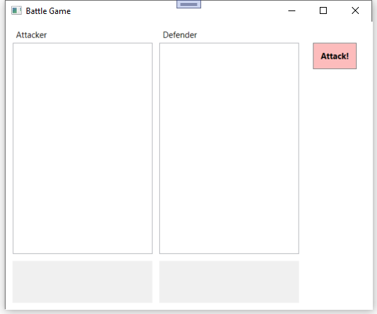

# Groepsopdracht WEL: battle game

Voor deze groepsopdracht programmeren jullie een spelletje waarin spelers elkaar kunnen aanvallen,
gebruik makend van bepaalde voorwerpen die een bonus opleveren voor aanval en/of verdediging.
Er liggen een aantal zaken vast, zoals de basis interfaces, maar jullie krijgen veel vrijheid
om de applicatie en spelregels zelf verder vorm te geven.
Overleg alles goed met je team en denk aan de vrij beperkte tijd die je samen krijgt om jullie ideeën
ook effectief te gaan implementeren!

## Class library

De start solution bevat reeds een class library `Wel.Battle.Game.Core` waarin de basis interfaces voorzien
zijn voor de klassen die jullie gaan schrijven.

**IInventoryItem**

Dit is de interface van een voorwerp dat door een speler kan worden opgeraapt.
Elk item brengt een `AttackBonus` en/of `DefenseBonus` op.
Dit zijn de enige twee verplichte properties.

**IPlayer**

Interface van een speler die deelneemt aan het spel.
Elke speler heeft (minstens) deze properties:
- `string Name`: de naam van de speler.
- `int Health`: geeft aan hoeveel leven de speler nog heeft.
- `List<IInventoryItem> Inventory`: de lijst met voorwerpen die de speler heeft opgeraapt.
- `int AttackStrength`: de totale aanvalskracht van de speler (rekening houdend met alle eventuele opgeraapte voorwerpen).
- `int DefenseStrength`: de totale verdedigingskracht van de speler (rekening houdend met alle eventuele opgeraapte voorwerpen).

Er zijn ook twee verplichte methodes:
- `Equip(IInventoryItem)`: hiermee raapt de speler een nieuw voorwerp op, dat wordt toegevoegd aan de *inventory*.
- `Attack(IPlayer)`: val een andere speler aan.

**IBattleGame**

Dit is de interface van de service klasse die het spel stuurt.
De enige verplichting is dat deze een lijst met deelnemende spelers moet aanbieden via de property `List<IPlayer> Players`.

## Spelregels

Wanneer speler `attacker` een speler `defender` aanvalt, geldt als basisregel dat de `Health` van de `defender` wordt verminderd
met `attacker.AttackStrength - defender.DefenseStrength`. Let hierbij op voor de randgevallen:
- Het leven van een speler kan nooit onder nul zakken.
- De verdediger kan enkel leven verliezen (ook als zijn verdedigingskracht groter is dan de aanvalskracht van de aanvaller).
- ...

Jullie zijn volledig vrij om uitbreidingen te implementeren op deze basisregel!

## Wpf interface

In de start solution is ook reeds een Wpf project `Wel.Battle.Game.Wpf` voorzien met een basis Wpf layout voor het spel.

Het is de bedoeling dat je de twee listboxen opvult met de deelnemende spelers.
Deze spelers mogen aangemaakt worden vanuit de service klasse (seeding) of je kan eventueel de Wpf layout uitbreiden
zodat er spelers kunnen worden aangemaakt, verwijderd, ...

Wanneer je een speler selecteert, zou in de textblock onder de listbox wat informatie over deze speler moeten verschijnen
(bv. naam, leven, sterkte, info opgeraapte voorwerpen, ...). Dit mag je zelf vormgeven. 
Zorg ook voor een duidelijke (maar beknopte) weergave van de spelers in de listbox.

Nadat je een aanvaller en verdediger hebt geselecteerd in de listboxes, kan je met de knop "Attack!" een aanval laten uitvoeren.
Zorg ervoor dat alle gegevens correct worden geüpdatet na de aanval.

Enkele aandachtspunten (waarvan je zelf in je team zal moeten beslissen hoe je er concreet mee wil omgaan):
- Een speler mag zichzelf niet kunnen aanvallen.
- Het moet duidelijk zijn welke spelers nog in leven zijn.
- Niet meer levende spelers kunnen geen aanval uitvoeren en ook niet aangevallen worden.
- ...

## Aan de slag!

Overleg met je team hoe je het spel zal vormgeven.
Zorg ervoor dat je zeker eerst de basis afdekt en begin eenvoudig.
Voorzie bv. als voorwerpen eerst gewoon een zwaard dat enkel een (vaste) aanvalsbonus opbrengt,
en een schild met een (vaste) bonus voor verdediging.

Denk er goed over na hoe je de taken zal organiseren zodat je tegelijkertijd aan de code kan werken
zonder elkaar te hinderen of blokkeren!
**Tips:**
- Werk bv. in de Wpf applicatie enkel met de interfaces van de class library,
zo kan je deze volledig parallel en onafhankelijk uitwerken terwijl anderen de concrete klassen
in de class library implementeren.
- Gebruik de technieken die je aangeleerd kreeg in de module CIB. Werk bv. met branches zodat je tegelijkertijd aan verschillende delen van de applicatie kan sleutelen.

Alhoewel we vooral rekenen op jullie eigen creativiteit, kan je misschien inspiratie halen uit deze
geheel vrijblijvende ideeën als uitbreiding op de basisregels van het spel:
- Spelers kunnen zelf ook al een basis aanvals- en of verdedigingskracht hebben (zonder opgeraapte voorwerpen).
  Die kan eventueel veranderen doorheen de tijd, bv. een speler die eerst heel sterk is maar na elke aanval wat sterkte verliest.
- Ook de bonus van een voorwerp kan je dynamisch maken en laten afhangen van allerlei factoren, bv. een sterk zwaard dat na elke
  aanval minder sterk wordt, of een schild dat breekt na een bepaald aantal verdedigingen en daarna geen bonus meer opbrengt, ...
- Je kan limieten plaatsen op het aantal opgeraapte voorwerpen per speler.
- Uiteraard zijn er ook heel wat uitbreidingsmogelijkheden in de Wpf: beheer van spelers en voorwerpen, voorwerpen laten oprapen, ...
- ...
